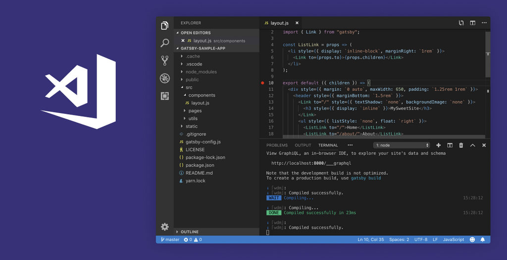

# Projekat - Oglasi - 

[![Build Status][build-shield]]()
[![Code][code-clean]]()
[![Contributors][contributors-shield]]()

<br />
<p align="center">
  <a href="">
    
  </a>

  <h3 align="center">Web sajt za oglasavanje i prodaju nekretnina</h3><br>


## Project

[![Oglasi][product-screenshot]]()

## Technology used

<p align="center">
    

[![][html]]()&nbsp;&nbsp;
[![][css]]()&nbsp;&nbsp;
[![][js]]()&nbsp;&nbsp;
[![][jquery]](https://jquery.com)&nbsp;&nbsp;
[![][json]]()&nbsp;&nbsp;
[![][webpack]](https://webpack.js.org/)&nbsp;&nbsp;
[![][axios]](https://www.npmjs.com/package/axios)&nbsp;&nbsp;
<br>
<br>
<p align="center">
    
<br>
<br>

## Installation

1. Clone the repo
```sh
git clone https:://github.com/darkomingovski/oglasi.git
```
2. Install NPM packages
```sh
npm install or npm i
```
3. Start JSON server
```sh
npm run server
```
<br>

## Project structure
```sh
.
├── dist
│   └── main.bundle.js
├── node_modules
├── src
│   ├── css
│   │   └── main.css
│   ├── img
│   ├── js
│   │   ├── vendor
│   │   │   └── jquery.js
│   │   ├── ad.js
│   │   ├── main.js
│   │   ├── publish_ad.js
│   │   ├── register.js
│   │   └── user_panel.js
│   ├── .edittorconfig
│   ├── ad.html
│   ├── Favicon.ico
│   ├── index.html
│   ├── publish_ad.html
│   ├── register.html
│   └── user_panel.html
├── .babelrc
├── .gitignore
├── db.json
├── package-lock.json
├── package.json
├── README.md
└── webpack.config.js
```


## Developers on this project

[@ Darko Mingovski](https://github.com/darkomingovski)<br>
[@ Danilo Lukic](https://github.com/Danilo3110)<br>
[@ Nikola Muncan](https://github.com/dzoniD)

Project Link: [Git Hub Repo - Oglasi](https://github.com/darkomingovski/oglasi)
<br>
<br>


## Acknowledgements

* [GitHub Emoji Cheat Sheet](https://www.webpagefx.com/tools/emoji-cheat-sheet)
* [Img Shields](https://shields.io)
* [Choose an Open Source License](https://choosealicense.com)
* [GitHub Pages](https://pages.github.com)
* [Animate.css](https://daneden.github.io/animate.css)
* [Loaders.css](https://connoratherton.com/loaders)
* [Slick Carousel](https://kenwheeler.github.io/slick)
* [Smooth Scroll](https://github.com/cferdinandi/smooth-scroll)
* [Sticky Kit](http://leafo.net/sticky-kit)
* [JVectorMap](http://jvectormap.com)
* [Font Awesome](https://fontawesome.com)


<!-- LINKS & IMAGES -->
[build-shield]: https://img.shields.io/badge/build-passing-brightgreen.svg?style=popout
[code-clean]: https://img.shields.io/badge/code_style-standard-brightgreen.svg?style=popout
[contributors-shield]: https://img.shields.io/badge/contributors-2-orange.svg?style=popout
[html]: https://img.shields.io/badge/HTML-v5-red.svg?style=popout&logo=html5
[css]: https://img.shields.io/badge/CSS-v3-blue.svg?style=popout&logo=css3
[js]: https://img.shields.io/badge/JavaScript-ES6-yellow.svg?style=popout&logo=javascript
[jquery]: https://img.shields.io/badge/jQuery-v3.3.1-violet.svg?style=popout&logo=jquery
[json]: https://img.shields.io/badge/JSON-v^0.14.2-green.svg?style=popout&logo=json
[webpack]: https://img.shields.io/badge/WebPack-v4.29.6-blue.svg?style=popout&logo=webpack
[axios]: https://img.shields.io/badge/AXIOS-v^0.18.0-lightblue.svg?style=popout&logo=codesandbox
[product-screenshot]: ./ss.jpg